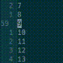
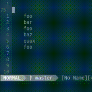

padline
=======

Features
--------

`padline` adds `<Plug>`-mappings and commands to insert or remove padding in the form of empty lines.

Padding can be added above, below or around a line or visual selection.

`padline` does not have any side-effects such as
 - changing cursor position
 - modifying jump-list
 - starting a new change (ie. it does not break dot-repeatability)

For more information, have a look at the [Documentation](doc/padline.txt)

Examples
--------

| Action | Description | Screencast |
|--------|-------------|------------|
| `<Plug>PadLineAbove` | add empty line above current line |  |
| `3<Plug>PadLineBelow` | add 3 empty lines below current line |  |
| `2<Plug>PadBlockAround` | add 2 empty lines around visual selection |  |
| `:56,60PadAround2<CR>` | add 2 empty lines around a range |  |
| `3<Plug>UnpadLineAround` | remove **up to** 3 **consecutive** empty lines around current line (note the unbalanced padding); `Unpad` searches for next occurrence of consecutive empty lines |  |
| `/foo` `cw` `hello<Esc>` `n` `<Plug>PadLineAbove` `.n.` | add empty line above current line, does not interfere with dot-repeatability |  |

Installation
------------

Using `vim-plug`:

Insert the following line in your `.vimrc` inside the `plug#begin(...)`/`plug#end()` block.

```
Plug 'notuxic/vim-padline'
```
